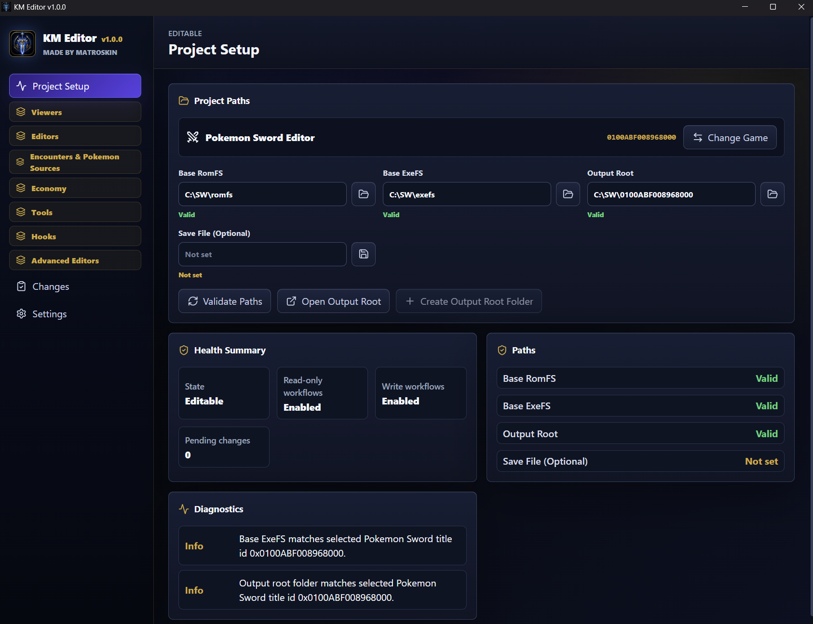

# KM Editor

KM Editor is a desktop editor for Pokemon Sword and Pokemon Shield mod projects.

It works through a safer LayeredFS flow: choose Sword or Shield, validate clean RomFS and ExeFS paths, inspect records with source provenance, stage edits, review the change plan, and apply only after validation. Your base dump stays clean, and the app tells you when something looks off before it writes output.

## What It Does

- Validates clean base RomFS, base ExeFS, output root, and selected game before editors open.
- Shows where records came from: base files, layered overrides, generated output, or pending edits.
- Edits Pokemon, trainers, moves, items, encounters, raids, shops, placement objects, and behavior data.
- Includes viewers for game text, flagwork metadata, and save-related inspection.
- Stages changes into an edit session so you can remove mistakes before applying.
- Uses reviewed change plans for higher-risk output, including hook-backed workflows.
- Supports Bag Hook, Royal Candy, Starting Items, Catch Cap, IV Screen, and Gym Uniform Removal through documented ownership rules.
- Checks for native app updates from Settings on updater-enabled builds.

## Build Requirements

KM Editor is currently built and packaged for Windows.

- .NET SDK `10.0.300`, from [`global.json`](global.json). The repo allows `latestFeature` roll-forward.
- Node.js `24.16.0` or newer, from the root [`package.json`](package.json) engines.
- pnpm `11.5.2` or newer. The repo is pinned to `pnpm@11.5.2`.
- Rust MSVC toolchain with `rustc` `1.77.2` or newer, matching [`apps/desktop/src-tauri/Cargo.toml`](apps/desktop/src-tauri/Cargo.toml).
- Visual Studio 2022 Build Tools with the `Desktop development with C++` workload, including MSVC and a Windows 10/11 SDK.
- Microsoft Edge WebView2 Runtime for the Tauri desktop shell. Windows 10 version 1803 and later, plus Windows 11, normally include it; install the Evergreen Runtime if it is missing.

Tauri's Windows prerequisites are documented here: [Tauri v2 prerequisites](https://v2.tauri.app/start/prerequisites/).

Installer and updater release builds also need Tauri updater signing secrets. See [docs/releases.md](docs/releases.md).

## Repository Layout

- [`src/`](src/): backend projects, binary formats, workflow services, API contracts, and bridge host.
- [`apps/desktop/`](apps/desktop/): React, TypeScript, Vite, and Tauri desktop app.
- [`tests/`](tests/): backend, format, integration, and desktop-facing contract coverage.
- [`docs/`](docs/): release notes, release process, and supporting repo docs.

## Documentation

- [Wiki Home](https://github.com/KotMatrosk1n/KM-Editor/wiki)
- [Project Setup](https://github.com/KotMatrosk1n/KM-Editor/wiki/Project-Setup)
- [Editing Workflow](https://github.com/KotMatrosk1n/KM-Editor/wiki/Editing-Workflow)
- [Hook Architecture](https://github.com/KotMatrosk1n/KM-Editor/wiki/Hook-Architecture)
- [Desktop app notes](apps/desktop/README.md)
- [Backend test notes](tests/README.md)

Catch Cap Editor, IV Screen, and Gym Uniform Removal are available as Advanced Editors with documented Sword/Shield ExeFS ownership rules. Rental Pokemon and Dynamax Adventures remain hidden as work in progress until their runtime safety work is finished. See the [Hook Architecture wiki page](https://github.com/KotMatrosk1n/KM-Editor/wiki/Hook-Architecture), [Gym Uniform Removal](https://github.com/KotMatrosk1n/KM-Editor/wiki/Gym-Uniform-Removal), [Rental Pokemon Editor](https://github.com/KotMatrosk1n/KM-Editor/wiki/Rental-Pokemon-Editor), and [Dynamax Adventures Editor](https://github.com/KotMatrosk1n/KM-Editor/wiki/Dynamax-Adventures-Editor).
